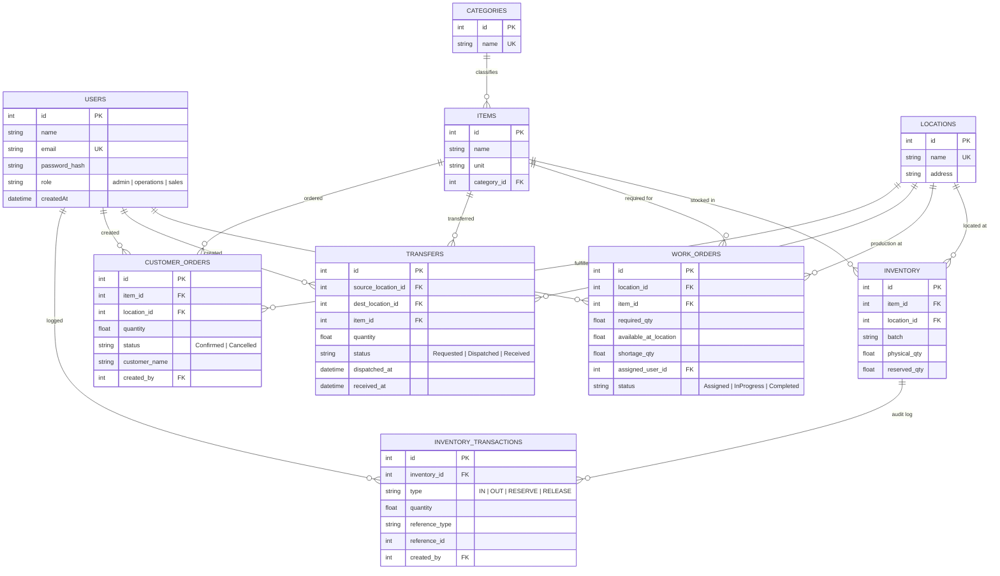

# erp mini — Full-Stack Operations ERP

**Full-Stack Developer Technical Case Study Submission**

---

## 1. Project Overview

**erp mini** is a production-oriented, full-stack Operations ERP that covers the complete inventory lifecycle:

**Inventory → Work Order → Stock Check → Internal Transfer / Shortage → Customer Reservation**

The system is designed for a company operating from multiple locations, managing inventory, work orders, internal stock transfers, and customer orders. It is built with a focus on **transaction safety**, **role-based access control**, **business logic correctness**, and **portable architecture**.

---

## 2. Live URLs

| Service | URL |
|---|---|
| **Frontend (Vercel)** | https://frontend-5fub.vercel.app/login |
| **Backend API (Render)** | https://erp-mini-gvdl.onrender.com |
| **API Documentation (Swagger)** | https://erp-mini-gvdl.onrender.com/api-docs |
| **GitHub Repository** | https://github.com/Adityakumar747/erp-mini |

---

## 3. Tech Stack

| Layer | Technology |
|---|---|
| **Frontend** | React 19, Vite, TailwindCSS v4, React Router DOM v7 |
| **Backend** | Node.js, Express.js |
| **Database** | SQLite (Node.js built-in `node:sqlite`, ACID Compliant, WAL mode) |
| **Authentication** | JWT (JSON Web Tokens), bcryptjs |
| **Security** | Role-Based Access Control (RBAC), Helmet, CORS |
| **Testing** | Jest, Supertest |
| **API Docs** | Swagger UI (`/api-docs`) |
| **Deployment** | Frontend → Vercel, Backend → Render |

---

## 4. Architecture

```
┌─────────────┐     HTTPS      ┌─────────────┐     SQLite      ┌─────────────┐
│   Browser   │ ─────────────► │   Express   │ ─────────────► │  Database   │
│  (Vercel)   │ ◄───────────── │   Backend   │ ◄───────────── │  (Render)   │
│             │    REST API    │  (Render)   │   ACID Txns    │  /tmp/       │
└─────────────┘                └─────────────┘                └─────────────┘
       │                           │
       │                           │
       │                           │
       ▼                           ▼
  React SPA                  JWT Auth + RBAC
  TailwindCSS                 Business Logic
  React Router                Controllers → Models
```

### Key Architectural Decisions

- **Relational Database**: SQLite with foreign key constraints enabled, WAL mode for concurrency
- **Transaction Safety**: All inventory mutations (reserve, transfer, dispatch, receive) run inside explicit `BEGIN` / `COMMIT` / `ROLLBACK` blocks
- **Concurrency Control**: SQLite serializes writes; combined with transactions, this guarantees no overselling under concurrent requests
- **Portable Configuration**: Environment-based configuration via `.env`; no hardcoded provider-specific values
- **Separation of Concerns**: Controllers handle HTTP, Models handle SQL, Middleware handles auth/z

---

## 5. Database Schema & ER Diagram

### Entity-Relationship Diagram



### Relational Schema Summary

| Table | Purpose | Key Relationships |
|---|---|---|
| `users` | Authentication & RBAC | Owns work orders, transfers, orders, transactions |
| `locations` | Warehouse/store locations | Referenced by inventory, work orders, transfers, orders |
| `categories` | Item classification | Parent of items |
| `items` | Products/materials | Child of categories; referenced by inventory, work orders, transfers, orders |
| `inventory` | Stock levels per item/location/batch | Links items + locations; parent of transactions |
| `inventory_transactions` | Audit log for all stock movements | Links inventory + users |
| `work_orders` | Production/manufacturing orders | Links location, item, assigned user |
| `transfers` | Internal stock transfers between locations | Links source/dest locations, item, creator |
| `customer_orders` | Sales orders with stock reservation | Links item, location, creator |

---

## 6. Authentication & Authorization

### Authentication Mechanism

- **JWT (JSON Web Tokens)** with `bcryptjs` password hashing
- Token payload contains `{ id, role }`
- Tokens expire after 7 days (configurable via `JWT_EXPIRES_IN`)
- All protected routes require `Authorization: Bearer <token>` header

### Role-Based Access Control (RBAC)

| Role | Permissions |
|---|---|
| **admin** | Create Work Orders, Manage Inventory, Manage Transfers, Create Orders, View All |
| **operations** | Manage Inventory (add stock), Create/Dispatch/Receive Transfers, View Work Orders |
| **sales** | Create Customer Orders, Reserve Stock, Cancel Orders |

### Authorization Enforcement

Backend authorization is enforced via middleware on every protected route:

```
GET    /api/inventory          → auth
POST   /api/inventory          → auth + authorize('admin', 'operations')
GET    /api/work-orders        → auth + authorize('admin', 'operations')
POST   /api/work-orders        → auth + authorize('admin')
PATCH  /api/work-orders/:id/status → auth + authorize('admin', 'operations')
GET    /api/transfers          → auth + authorize('admin', 'operations')
POST   /api/transfers          → auth + authorize('admin', 'operations')
PATCH  /api/transfers/:id/dispatch → auth + authorize('admin', 'operations')
PATCH  /api/transfers/:id/receive  → auth + authorize('admin', 'operations')
GET    /api/orders             → auth + authorize('admin', 'sales')
POST   /api/orders             → auth + authorize('admin', 'sales')
PATCH  /api/orders/:id/cancel  → auth + authorize('admin', 'sales')
```

---

## 7. Module Details & Business Logic

### 7.1 Inventory Management

**Fields tracked:**
- Item, Category, Location, Batch
- Physical Quantity (actual stock on shelf)
- Reserved Quantity (stock blocked for orders)
- Available Quantity = `physical_qty - reserved_qty` (computed)

**Prevention rules:**
- No negative inventory
- No invalid quantities (must be positive)
- No duplicate inventory transactions per batch
- Reservation cannot exceed available quantity

**Endpoints:**
- `GET /api/inventory` — List all inventory with filters
- `GET /api/inventory/:id` — Detail with transaction history
- `POST /api/inventory` — Add/adjust stock (admin/operations)
- `GET /api/inventory/items` — List all items
- `GET /api/inventory/locations` — List all locations

### 7.2 Work Orders + Material Stock Check

**Minimum fields:**
- Work Order ID (auto-generated)
- Location, Item, Required Quantity
- Assigned User, Status

**Statuses:** `Assigned` → `InProgress` → `Completed`

**Automatic stock check on creation:**
- System queries available stock at the specified location
- Calculates `shortage_qty = max(0, required_qty - available_at_location)`
- Stores `available_at_location` and `shortage_qty` on the work order

**Endpoints:**
- `POST /api/work-orders` — Create (admin only)
- `GET /api/work-orders` — List (admin/operations)
- `GET /api/work-orders/:id` — Detail
- `PATCH /api/work-orders/:id/status` — Update status

### 7.3 Internal Stock Transfer

**Two-stage transactional flow:**

| Stage | Action | Inventory Effect |
|---|---|---|
| **Requested** | Transfer created | No change |
| **Dispatched** | Source confirms shipment | Source physical_qty reduces |
| **Received** | Destination confirms receipt | Destination physical_qty increases |

**Critical rules enforced:**
- Source and destination must be different locations
- Cannot dispatch more than available at source
- Destination inventory does NOT increase before receipt
- Same transfer cannot be received twice (idempotency guard via `received_at` timestamp + status check → `409 Conflict`)

**Endpoints:**
- `POST /api/transfers` — Create transfer request
- `GET /api/transfers` — List all transfers
- `PATCH /api/transfers/:id/dispatch` — Dispatch (reduces source stock)
- `PATCH /api/transfers/:id/receive` — Receive (increases destination stock)

### 7.4 Customer Order & Stock Reservation

**Atomic reservation on order creation:**
- Checks total available stock (`physical_qty - reserved_qty`) across all batches
- If sufficient, atomically reserves stock and creates order
- If insufficient, rejects with `400 Bad Request`

**Concurrency safety:**
- Entire reserve operation runs inside a database transaction
- SQLite serializes concurrent writes, guaranteeing that two users cannot reserve more stock than exists

**Cancellation releases stock:**
- Cancelling an order releases reserved quantity back to available
- Logs `RELEASE` transactions for audit

**Endpoints:**
- `POST /api/orders` — Create order and reserve stock (admin/sales)
- `GET /api/orders` — List orders
- `PATCH /api/orders/:id/cancel` — Cancel and release stock

---

## 8. API Documentation

Interactive Swagger UI is available at:
**https://erp-mini-gvdl.onrender.com/api-docs**

All endpoints are documented with:
- Request/response schemas
- Required fields
- Example values
- Authorization requirements

---

## 9. Testing

### Test Suite

Run locally:
```bash
cd backend
npm test:jest
```

### Deployed Test Coverage (14 tests, all passing)

| Test | Description | Expected Result |
|---|---|---|
| **Test 1** | Cannot reserve more than available inventory | `400 Bad Request` |
| **Test 2** | Cannot transfer more than available inventory | `400 Bad Request` |
| **Test 3** | Destination stock increases only after transfer receipt | Source reduces on dispatch, dest unchanged until receipt |
| **Test 4** | Same transfer cannot be received twice | `409 Conflict` |
| **Test 5** | Unauthorized user cannot perform restricted operation | `403 Forbidden` |
| **Bonus** | Concurrency — two users cannot oversell same stock | Exactly one succeeds, one fails |

### Test Implementation Details

- Tests use **Jest** + **Supertest**
- In-memory SQLite database (`:memory:`) for isolation
- Each test suite seeds fresh demo data
- Transactions are tested for atomicity and rollback behavior

---

## 10. Frontend Screens

| Screen | Route | Description |
|---|---|---|
| **Login** | `/login` | Email/password auth with demo role quick-fill |
| **Inventory** | `/inventory` | Multi-location stock table with filters, add stock modal, audit log |
| **Work Orders** | `/work-orders` | Create WOs with live stock check, shortage display, status progression |
| **Internal Transfers** | `/transfers` | Request/Dispatch/Receive with workflow timeline and duplicate-receive protection |
| **Customer Orders** | `/orders` | Reserve stock atomically, cancel orders, live available stock preview |

### Role-Based UI

- Navigation items are filtered by role
- Action buttons are shown/hidden based on permissions
- Demo role switcher in navbar for quick testing

---

## 11. Environment Configuration

### Backend Environment Variables (Render)

```
JWT_SECRET=erp_mini_2026_super_secret_jwt_key_change_in_production_xyz789
JWT_EXPIRES_IN=7d
NODE_ENV=production
DB_STORAGE=/tmp/database.sqlite
```

### Frontend Environment Variables (Vercel)

```
VITE_API_URL=https://erp-mini-gvdl.onrender.com/api
```

### Local Development

```bash
# Backend
cd backend
cp .env.example .env
npm install
npm run seed
npm start

# Frontend
cd frontend
npm install
npm run dev
```

---

## 12. Deployment Architecture

| Component | Platform | URL |
|---|---|---|
| Frontend | Vercel | https://frontend-5fub.vercel.app/login |
| Backend | Render | https://erp-mini-gvdl.onrender.com |
| Database | SQLite on Render (`/tmp/database.sqlite`) | Ephemeral (auto-seeds on restart) |
| Source Control | GitHub | https://github.com/Adityakumar747/erp-mini |

### Deployment Notes

- **Frontend**: Built with Vite, output in `dist/`, served via Vercel’s CDN
- **Backend**: Node.js server on Render free tier, auto-deploys on push to `main`
- **Database**: SQLite file stored in `/tmp` (ephemeral). Auto-seeds on first boot via `server.js`
- **CORS**: Backend allows all origins (`*`) for Vercel → Render communication
- **SPA Routing**: `vercel.json` rewrites all routes to `/` for client-side routing

---

## 13. How to Run & Test

### Local Setup

```bash
# 1. Clone repository
git clone https://github.com/Adityakumar747/erp-mini.git
cd erp-mini

# 2. Backend
cd backend
npm install
npm run seed
npm start

# 3. Frontend (new terminal)
cd frontend
npm install
npm run dev
```

### Test Credentials

| Role | Email | Password |
|---|---|---|
| Admin | admin@erp.com | admin123 |
| Operations | ops@erp.com | ops123 |
| Sales | sales@erp.com | sales123 |

### Run Automated Tests

```bash
cd backend
npm test:jest
```

---

## 14. Business Flow Demonstration

The complete flow covered by the system:

```
1. Admin creates Work Order
   └─► System auto-calculates available stock and shortage

2. If shortage exists → Operations creates Internal Transfer
   ├─► Requested
   ├─► Dispatched (source stock reduces)
   └─► Received (destination stock increases)

3. Sales creates Customer Order
   └─► System atomically reserves available stock
       ├─► Success → Order confirmed, stock reserved
       └─► Failure → Insufficient stock error

4. Cancel Order
   └─► Reserved stock released back to inventory
```

---

## 15. Key Technical Highlights

- **ACID Transactions**: All critical operations (reserve, transfer, dispatch, receive) use explicit database transactions with rollback on error
- **Concurrency Safety**: SQLite write serialization + transactions prevents race conditions in stock reservation
- **Idempotency Guards**: Transfer receipt uses both `status` check and `received_at` timestamp to prevent double-processing
- **Audit Trail**: Every inventory mutation is logged in `inventory_transactions` with type, quantity, reference, and user
- **Role-Based UI + API**: Both frontend navigation and backend routes enforce role restrictions
- **Portable Configuration**: Environment variables for all sensitive/configurable values; no hardcoded secrets
- **Auto-Seeding**: Database self-initializes on first boot, requiring no manual database setup for demo/CI

---

## 16. Project Structure

```
erp-mini/
├── backend/
│   ├── src/
│   │   ├── app.js                    # Express app setup
│   │   ├── config/
│   │   │   ├── database.js           # SQLite connection, transactions, init
│   │   │   └── swagger.js            # Swagger spec
│   │   ├── controllers/
│   │   │   ├── auth.controller.js
│   │   │   ├── inventory.controller.js
│   │   │   ├── workorder.controller.js
│   │   │   ├── transfer.controller.js
│   │   │   └── order.controller.js
│   │   ├── middleware/
│   │   │   ├── auth.js               # JWT verification
│   │   │   └── authorize.js          # Role-based access
│   │   ├── models/
│   │   │   └── index.js              # SQL query helpers (raw node:sqlite)
│   │   ├── routes/
│   │   │   ├── auth.routes.js
│   │   │   ├── inventory.routes.js
│   │   │   ├── workorder.routes.js
│   │   │   ├── transfer.routes.js
│   │   │   └── order.routes.js
│   │   └── seeders/
│   │       └── seed.js               # Demo data seeder
│   ├── server.js                     # Entry point with auto-seed
│   ├── package.json
│   └── .env.example
├── frontend/
│   ├── src/
│   │   ├── api/
│   │   │   └── axios.js              # Axios instance with interceptor
│   │   ├── components/
│   │   │   └── Navbar.jsx            # Role-aware navigation
│   │   ├── context/
│   │   │   └── AuthContext.jsx        # Auth state management
│   │   ├── pages/
│   │   │   ├── Login.jsx
│   │   │   ├── Inventory.jsx
│   │   │   ├── WorkOrders.jsx
│   │   │   ├── Transfers.jsx
│   │   │   └── CustomerOrders.jsx
│   │   ├── routes/
│   │   │   └── ProtectedRoute.jsx
│   │   ├── App.jsx                   # Router + role-based route guards
│   │   └── main.jsx
│   ├── index.html
│   ├── vite.config.js
│   ├── vercel.json                   # SPA routing rewrites
│   └── package.json
├── README.md
└── SUBMISSION.md                  
```

---


